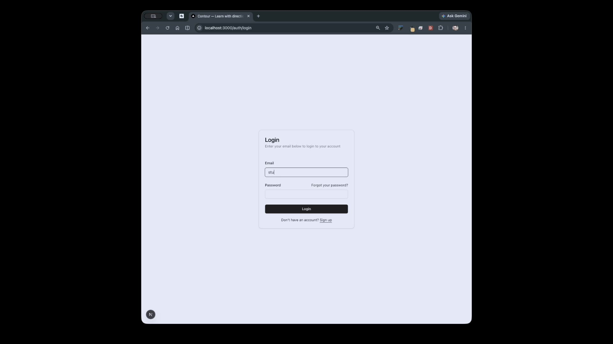

<h1 align="center">Contour Mini LMS</h1>

A small learning management system built with Next.js 15, React 19, Supabase, Tailwind CSS, and shadcn/ui. The current MVP provides password authentication and a role-aware consultation workflow for students and admins.

[](https://youtu.be/tCBLW-neOaU)

## Overall implementation

- Students can sign up, log in, reset their password, book consultations, and view their own consultations.
- Students can reschedule a consultation, mark it complete or incomplete, or cancel it. Cancellation preserves the record instead of deleting it.
- Admins have a read-only view of every student's consultations, including cancelled consultations.
- The dashboard routes users to the correct student or admin view based on the role stored in `public.user_roles`.
- Client forms send requests to Next.js route handlers under `app/api`; the app does not use Server Actions.
- Supabase SSR cookie authentication and the root `proxy.ts` refresh sessions for server-rendered routes.
- Authorization is enforced in Postgres with grants and row-level security (RLS), not only in the UI or API layer.
- The database is defined declaratively in `supabase/schemas/consultations.sql`. Generated migrations live in `supabase/migrations`, local fixtures live in `supabase/seed.sql`, and pgTAP coverage lives in `supabase/tests`.

## Special setup instructions

### Prerequisites

- Node.js and npm
- Docker Desktop, OrbStack, or another Docker-compatible runtime running locally

The application is intended to use the local Supabase stack during development.

### First-time setup

1. Install dependencies:

   ```bash
   npm install
   ```

2. Start the local Supabase services:

   ```bash
   npx supabase start
   ```

3. Create `.env.local` from `.env.example`, then populate it with the local API URL and publishable key (labelled `anon key` by older CLI versions) shown by `npx supabase status`:

   ```bash
   cp .env.example .env.local
   npx supabase status
   ```

   The required variables are:

   ```dotenv
   NEXT_PUBLIC_SUPABASE_URL=http://127.0.0.1:54321
   NEXT_PUBLIC_SUPABASE_PUBLISHABLE_KEY=<local publishable key>
   ```

4. Reset the local database once to apply the migrations and load the seed data:

   ```bash
   npx supabase db reset
   ```

5. Start the application:

   ```bash
   npm run dev
   ```

   Open [http://localhost:3000](http://localhost:3000). The `predev` script starts Supabase if necessary and pushes pending local migrations before Next.js starts.

### Seeded local accounts

Both accounts use the password `password123` and are for local development only.

| Role    | Email                 | Starting route             |
|---------|-----------------------|----------------------------|
| Student | `student@example.com` | `/dashboard/consultations` |
| Admin   | `admin@example.com`   | `/admin/consultations`     |

Local confirmation and password-reset emails are captured by the local Supabase email inbox at [http://127.0.0.1:54324](http://127.0.0.1:54324); they are not delivered externally.

### Database development

Treat `supabase/schemas/*.sql` as the source of truth. Make schema, RLS, function, trigger, grant, and index changes there, then generate and review the corresponding migration rather than editing the database or hand-writing a migration first.

Useful commands:

```bash
npx supabase db reset   # rebuild the local database and reload seed data
npx supabase test db    # run the pgTAP RLS and access-boundary tests
npx eslint app components lib proxy.ts
npx tsc --noEmit
npm run build
```

`npm run lint` currently scans generated and dependency directories, so the source-scoped ESLint command above is the useful check for this repository.

## Justifications and assumptions

- **Local-first development:** Local Supabase is required so authentication, RLS, schema changes, and seed data can be exercised without changing a hosted project.
- **Database-enforced authorization:** RLS is the primary security boundary. Students can select, insert, and update only their own records; admins can select all records but cannot create, update, or delete them. Route-level role checks provide earlier, clearer failures but do not replace RLS.
- **Roles are managed data:** Every newly created user receives the `student` role through a database trigger. Admin promotion is assumed to be an administrative provisioning task; there is intentionally no role-management UI in this MVP.
- **Cancellation is historical:** Cancelling changes the status to `cancelled` rather than deleting the row. Cancelled consultations cannot later be rescheduled or moved back to another status, preserving their historical meaning.
- **UTC is canonical:** Consultation times are submitted, stored, and displayed as UTC to avoid browser and server timezone ambiguity.
- **API route handlers are the mutation boundary:** Browser forms call same-origin Next.js endpoints. Mutating endpoints reject cross-site origins, validate request data, authenticate with cookie-backed Supabase claims, and rely on RLS for ownership enforcement.
- **Admin access is intentionally read-only:** The requirements only call for a system-wide admin view, so the admin UI exposes no consultation management actions.
- **MVP scope is deliberately small:** Notifications, availability and conflict checks, search/filtering, cancellation reasons, reschedule history, and extra consultation metadata are not implemented.

## Project origins

The project was initially scaffolded with:

```bash
npx create-next-app --example with-supabase contour-mini-lms
```
